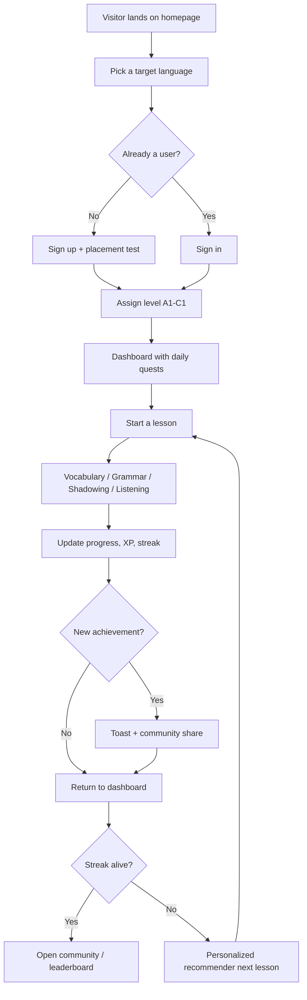

# PRD — Lingo Atlas: Immersive Multilingual Learning Platform

## 1. Product Overview

Lingo Atlas is a desktop-first, immersive online education platform that supports learning of English, Japanese, Korean, and other mainstream languages through a unified leveled curriculum. The product combines spaced-repetition vocabulary drills, grammar workshops, AI-assisted oral shadowing, and adaptive listening labs, then layers on progress telemetry, personalized learning paths, and a gamified community to keep learners engaged.

- **Target users**: self-directed adult learners, university students, and global language enthusiasts who want measurable progress in reading, writing, listening, and speaking across multiple languages.
- **Core value**: a single, beautifully designed hub that turns fragmented language learning into a guided journey, from placement test to fluency, with a visible record of growth.
- **Differentiator**: a polyglot-first curriculum engine (one account, many languages), real-time pronunciation feedback, and a vibrant community that rewards consistency.

## 2. Core Features

### 2.1 User Roles

| Role | Registration Method | Core Permissions |
|------|---------------------|------------------|
| Learner | Email + password (or social demo) | Browse curriculum, take lessons, track progress, post in community, earn achievements |
| Mentor (read-only demo) | Promoted by admin (mock) | Comment on learner posts, pin guidance threads |

### 2.2 Feature Modules

1. **Landing / Onboarding**: hero, language tiles, placement-test CTA, social proof.
2. **Authentication**: sign-up, sign-in, password recovery (mock), persistent session in `localStorage`.
3. **Dashboard**: streak, daily quests, level progress, recommended next lesson, recent achievements.
4. **Course Library**: language switcher, leveled tracks (A1–C1), module cards, filters by skill.
5. **Lesson Player (4 modules)**: vocabulary, grammar, oral shadowing, listening — each with its own interactive UI.
6. **Progress & Analytics**: per-skill radar, weekly heatmap, accuracy timeline, mastered words list.
7. **Personalized Path**: AI-styled recommender (rule-based mock) that suggests next lessons by gaps.
8. **Community**: feed of posts, comments, reactions, leaderboard, mentor highlights.
9. **Achievements & Shop**: badges, XP, streak rewards, cosmetic rewards (themes, avatars).
10. **Profile / Settings**: avatar, native language, target language, notification toggles, sign-out.

### 2.3 Page Details

| Page | Module | Feature Description |
|------|--------|---------------------|
| Landing | Hero | Animated polyglot headline, language strip (EN / 日本語 / 한국어 / 中文 / Français / Español / Deutsch / Italiano), CTA to placement test |
| Landing | Trust strip | "1.2M learners" style stat blocks with subtle parallax |
| Auth | Sign-in | Email + password, demo account quick-fill, language switcher persists |
| Auth | Sign-up | Username, email, password, native language, target language |
| Dashboard | Streak hero | Current streak with flame glyph, "Today" lesson tile, XP bar |
| Dashboard | Skill rings | Reading / Writing / Listening / Speaking rings with % to next level |
| Dashboard | Daily quests | 3 quest cards (e.g., "Review 10 words") with progress bars and XP rewards |
| Library | Language tabs | EN / JA / KO / ZH / FR / ES / DE / IT with flags and active state |
| Library | Track grid | Levels A1–C1, each card shows units, hours, and progress % |
| Lesson | Vocabulary | Flashcard stack with flip animation, "Know" / "Review" buttons, IPA + audio play |
| Lesson | Grammar | Fill-in-the-blank, multiple choice, conjugation drag-and-drop; shows rule + example |
| Lesson | Shadowing | Audio prompt, waveform visualizer, recording timer, similarity score (mocked) |
| Lesson | Listening | Multiple choice + dictation with audio replay limit |
| Progress | Radar | 4-axis skill radar with current vs. target values |
| Progress | Heatmap | 12-week contribution heatmap of study minutes |
| Path | Recommender | "Why this lesson" rationale, difficulty match, estimated minutes |
| Community | Feed | Post composer, post cards with language tag, reactions, comment thread |
| Community | Leaderboard | Weekly / all-time tabs, top learners with avatar, XP, streak |
| Achievements | Gallery | Locked/unlocked badges with rarity, unlock date, XP value |
| Profile | Header | Avatar, bio, languages, joined date, public stats |
| Settings | Forms | Native/target language, audio autoplay, reduced motion, sign out |

## 3. Core Process

1. New visitor lands on the marketing page, picks a language tile, and is prompted to sign up.
2. After sign-up, the platform asks for native and target languages, then runs a short placement test (5 questions across skills).
3. Based on the placement score, the recommender assigns a level (A1–C1) and queues the first 3 lessons.
4. The learner starts a lesson; the player tracks correctness, response time, and audio similarity, then updates the global progress store.
5. XP, streak, and any unlocked achievements are announced via a toast; the dashboard refreshes instantly.
6. The learner can share a result card to the community feed, comment on others, and climb the leaderboard.
7. The recommender continuously re-ranks the path using the last 7 days of accuracy and time-on-task.

## 4. User Interface Design

### 4.1 Design Style

- **Concept**: "Cartographic Atlas" — each language is a territory on a stylized world map; the UI feels like a leather-bound field journal with crisp modern type. Think editorial-meets-cartography: subtle parchment texture, gold leaf accents, hand-drawn vector flourishes, and deep navy ink.
- **Palette**:
  - Ink (primary text): `#0E1320`
  - Parchment (background): `#F4ECDA`
  - Vellum (surface): `#FBF6E9`
  - Cardinal (accent): `#C8362D`
  - Lapis (secondary): `#1E3A8A`
  - Verdigris (success): `#3B8266`
  - Gilt (highlight): `#C8A24A`
- **Typography**:
  - Display: "Cormorant Garamond" (serif, weight 500/700) for hero and level markers
  - Body: "Inter Tight" (sans) at 14–16px
  - Mono / IPA: "JetBrains Mono"
  - CJK: "Noto Serif JP", "Noto Serif KR", "Noto Serif SC" (web fonts)
- **Components**: pill buttons with 1px gilt border and ink fill, 6px radius, pressed state shifts to vermilion underline. Cards have a 1px hairline + 8px soft shadow.
- **Iconography**: thin-line Lucide icons; map pins and compass accents are custom SVG.
- **Motion**: 320ms ease-out for card hovers; staggered reveal (60ms steps) on dashboard mount; gold underline draws on CTA hover; reduced-motion respected.

### 4.2 Page Design Overview

| Page | Module | UI Elements |
|------|--------|-------------|
| Landing | Hero | Two-column editorial layout, oversized serif headline, animated language ticker, gilt-underline CTA, hand-drawn compass |
| Auth | Forms | Centered card on parchment, gold corner ornaments, language pill switcher |
| Dashboard | Streak hero | Horizontal stat strip: Streak / XP / Level / Hearts, each with a custom glyph |
| Dashboard | Quests | 3-column quest grid, progress arcs, gilt reward chip |
| Library | Track grid | 4-column grid of "atlas" cards with map-pin icons, level roman numerals, progress bar |
| Lesson | Vocabulary | Stacked flashcards with flip animation, IPA + romanization, audio play button (pulse) |
| Lesson | Grammar | Question card with options; correct answer triggers gilt confetti |
| Lesson | Shadowing | Split: left = waveform + controls, right = transcript highlight; similarity meter |
| Lesson | Listening | Audio player + question card; replay count badge |
| Progress | Radar | SVG radar chart with parchment grid; legend chips |
| Progress | Heatmap | GitHub-style heatmap, gilt = high activity |
| Community | Feed | Composer with language tag picker; post cards with reactions row and comment drawer |
| Community | Leaderboard | Ranked list with podium for top 3, gilt crown on #1 |
| Achievements | Gallery | Hexagonal badge grid with locked state in monochrome |
| Profile | Header | Banner with map fragment, avatar, language chips |

### 4.3 Responsiveness

- Desktop-first: optimized for 1280–1920px.
- Below 1024px: switch to 2-column grids; nav collapses to icon rail.
- Below 768px: single column, sticky bottom nav, lesson player simplifies to full-screen cards.

### 4.4 3D Scene Guidance

Not applicable — the product emphasizes editorial 2D design with subtle paper texture and gold-leaf accents. Heavy 3D is avoided for performance and to keep the field-journal metaphor.
