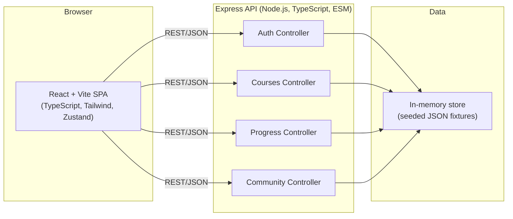
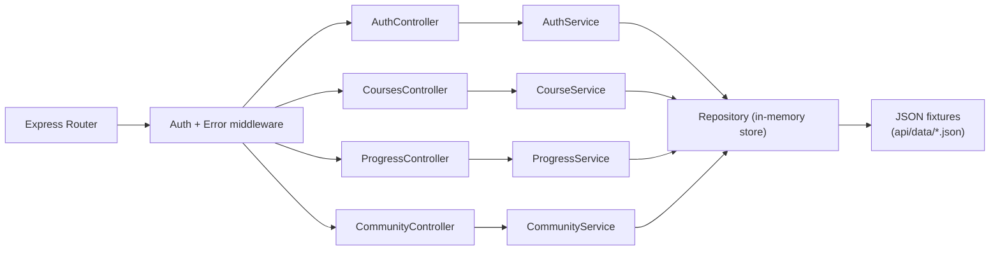
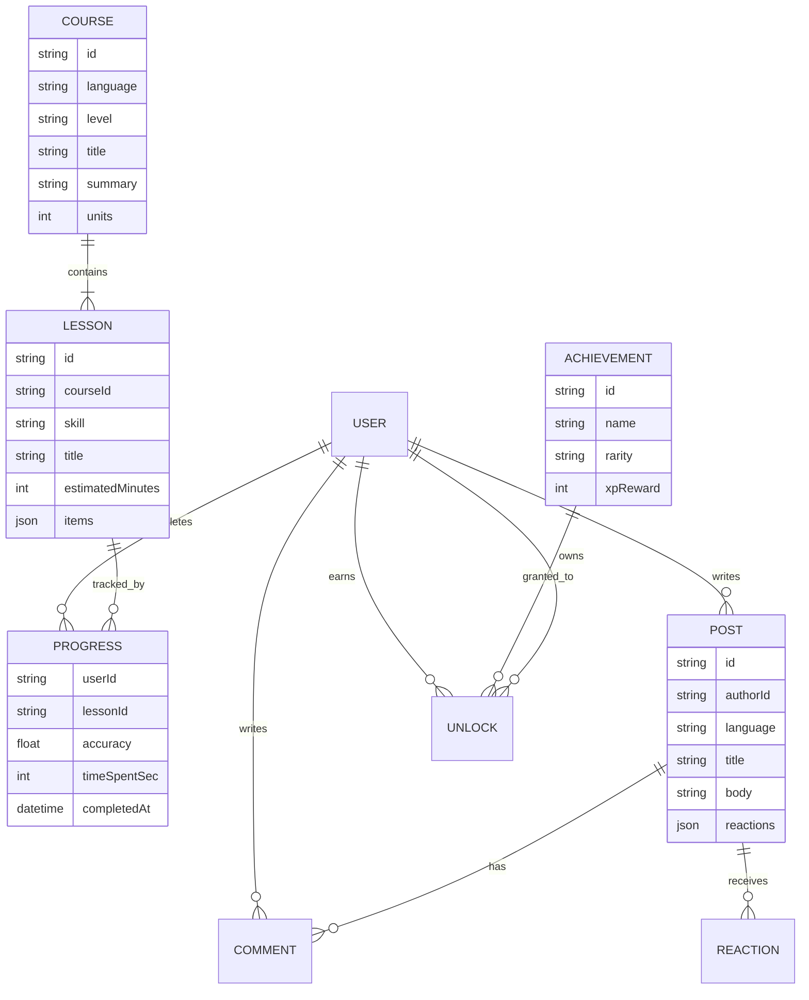

# Technical Architecture — Lingo Atlas

## 1. Architecture Design

Lingo Atlas is delivered as a single-page React + TypeScript application backed by an Express (Node.js) API. The frontend renders every page (landing, auth, dashboard, library, lesson player, progress, community, achievements, profile) through React Router. The backend exposes a small REST surface for authentication, course catalog, lesson state, and community posts. All persistent data lives in an in-process store seeded from JSON fixtures so the platform is fully runnable in a sandbox with zero external services.



## 2. Technology Description

- **Frontend**: React 18 + TypeScript + Vite, Tailwind CSS 3 for utility styling, Zustand for state, React Router 6 for routing, Lucide for icons, Framer Motion (CSS-only fallback) for motion.
- **Initialization tool**: `vite-init` template `react-express-ts` (frontend + Express backend in one project).
- **Backend**: Express 4 in TypeScript ESM, served from `api/` with controllers per domain.
- **Database**: in-memory store seeded from `api/data/*.json` (users, courses, lessons, posts, achievements). No external DB required; easy to swap later.
- **Audio**: Web Speech API + HTML5 Audio for TTS / shadowing prompts; waveforms rendered with a lightweight custom canvas component.
- **Persistence**: user session mirrored to `localStorage`; server also keeps the canonical in-memory record.
- **Build**: Vite for the SPA, `tsc` for the server, single root `package.json` with workspace-style scripts.

## 3. Route Definitions

| Route | Purpose |
|-------|---------|
| `/` | Marketing landing page with language tiles and CTAs |
| `/auth/sign-in` | Sign-in form (email + password) with demo quick-fill |
| `/auth/sign-up` | Sign-up form with native + target language |
| `/onboarding` | Placement test (5 questions) and level assignment |
| `/app` | Authenticated layout shell (sidebar + topbar) |
| `/app/dashboard` | Streak, XP, quests, recommendations |
| `/app/library` | Course catalog with language + level filters |
| `/app/library/:courseId` | Course detail with unit list |
| `/app/learn/:lessonId` | Lesson player (vocab / grammar / shadowing / listening) |
| `/app/progress` | Skill radar, heatmap, accuracy timeline |
| `/app/path` | Personalized recommender view |
| `/app/community` | Feed + comments + leaderboard tabs |
| `/app/achievements` | Badge gallery |
| `/app/profile` | Public profile card with stats |
| `/app/settings` | Account, languages, accessibility toggles |

## 4. API Definitions

```ts
// shared types
export type LanguageCode = "en" | "ja" | "ko" | "zh" | "fr" | "es" | "de" | "it";
export type Skill = "reading" | "writing" | "listening" | "speaking";
export type Level = "A1" | "A2" | "B1" | "B2" | "C1";

export interface User {
  id: string;
  username: string;
  email: string;
  nativeLanguage: LanguageCode;
  targetLanguage: LanguageCode;
  level: Level;
  xp: number;
  streak: number;
  hearts: number;
  joinedAt: string;
  avatarSeed: string;
}

export interface Lesson {
  id: string;
  courseId: string;
  language: LanguageCode;
  level: Level;
  skill: Skill;
  title: string;
  estimatedMinutes: number;
  items: LessonItem[];
}

export type LessonItem =
  | { type: "vocab"; prompt: string; translation: string; ipa?: string; example?: string }
  | { type: "grammar"; prompt: string; answer: string; choices: string[]; rule: string }
  | { type: "shadow"; prompt: string; transliteration: string; translation: string }
  | { type: "listen"; audio: string; question: string; choices: string[]; answer: string };

export interface ProgressEntry {
  userId: string;
  lessonId: string;
  accuracy: number; // 0-1
  timeSpentSec: number;
  completedAt: string;
}

export interface Post {
  id: string;
  authorId: string;
  language: LanguageCode;
  title: string;
  body: string;
  reactions: { fire: number; clap: number; sparkle: number };
  comments: Comment[];
  createdAt: string;
}

export interface Comment {
  id: string;
  authorId: string;
  body: string;
  createdAt: string;
}

export interface Achievement {
  id: string;
  name: string;
  description: string;
  rarity: "common" | "rare" | "epic" | "legendary";
  xpReward: number;
}
```

### Endpoints

| Method | Path | Purpose |
|--------|------|---------|
| POST | `/api/auth/sign-up` | Create account, return user + token |
| POST | `/api/auth/sign-in` | Authenticate, return user + token |
| GET  | `/api/auth/me` | Current user from token |
| GET  | `/api/courses` | List courses filtered by `language` and `level` |
| GET  | `/api/courses/:id` | Course detail with unit list |
| GET  | `/api/lessons/:id` | Lesson payload |
| POST | `/api/progress` | Submit lesson result, update XP / streak / achievements |
| GET  | `/api/progress/:userId` | Per-skill stats + heatmap data |
| GET  | `/api/recommendations/:userId` | Ranked list of next lessons |
| GET  | `/api/community/posts` | Community feed |
| POST | `/api/community/posts` | Create post |
| POST | `/api/community/posts/:id/comments` | Add comment |
| POST | `/api/community/posts/:id/reactions` | Toggle reaction |
| GET  | `/api/community/leaderboard` | Weekly + all-time leaderboards |
| GET  | `/api/achievements` | All achievements with unlock status |
| GET  | `/api/users/:id` | Public profile |

## 5. Server Architecture Diagram



## 6. Data Model

### 6.1 Entity Relationship



### 6.2 Seeded Data (DDL-equivalent JSON)

The store is initialized with:
- **8 languages** with display labels, flags, and CJK font fallbacks.
- **5 courses per language** (A1–C1) with 6 units each.
- **3 lessons per unit** spanning vocab, grammar, shadow, and listen skills (≈ 30 lessons per language).
- **12 achievements** (First Steps, Week Warrior, Polyglot, etc.) with rarity tiers.
- **20 demo posts** with multilingual bodies and seeded reactions.
- **10 demo users** that populate the leaderboard.

### 6.3 Project Structure

```
/workspace
├── api/
│   ├── data/                # JSON seed fixtures
│   ├── controllers/         # auth, courses, progress, community
│   ├── services/            # business logic
│   ├── store/               # in-memory repository
│   ├── routes.ts            # Express router
│   └── index.ts             # server entry (port 4000)
├── src/
│   ├── components/          # UI components, layout, lesson modules
│   ├── pages/               # route-level pages
│   ├── store/               # Zustand slices
│   ├── lib/                 # api client, i18n helpers
│   ├── hooks/               # reusable hooks
│   ├── styles/              # global CSS / Tailwind layers
│   └── App.tsx              # router root
├── shared/                  # cross-cutting TypeScript types
├── .trae/documents/         # PRD + Technical Architecture
├── index.html
├── package.json
├── tailwind.config.js
├── postcss.config.js
├── tsconfig.json
└── vite.config.ts
```

### 6.4 Run Scripts

- `npm run dev` — starts the Vite dev server on port 5173 (with proxy to API on 4000).
- `npm run server` — runs the Express API in watch mode.
- `npm run build` — type-check + build frontend and server.
- `npm run check` — TypeScript no-emit check.
